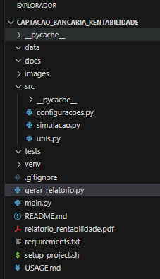
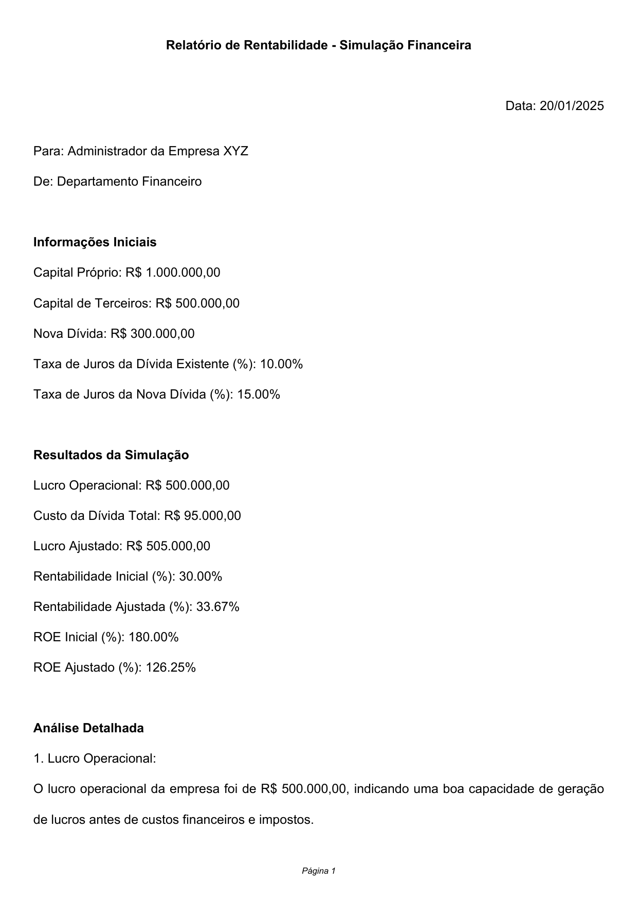

# 📊 Simulador de Rentabilidade e Gestão Financeira

Este projeto utiliza **Python** para automatizar a análise de rentabilidade e ajudar administradores financeiros a tomarem decisões estratégicas sobre captação de dívidas e gestão financeira. Ele calcula indicadores financeiros essenciais e gera um relatório em **PDF** com análises detalhadas.

## ✨ **Visão Geral**

Tomar decisões financeiras embasadas é essencial para o sucesso de uma empresa. Este simulador ajuda a:

- Calcular o impacto financeiro de novas dívidas.
- Analisar a rentabilidade e o retorno sobre o capital próprio (ROE).
- Gerar relatórios claros e objetivos para facilitar a tomada de decisão.

Com o uso deste script, você economiza tempo e reduz erros em cálculos financeiros complexos.

## 🛠 **Tecnologias Utilizadas**

- **Python 3.10+**
- **Bibliotecas**:
  - [FPDF](https://pypi.org/project/fpdf/) - Para geração de relatórios em PDF.
  - [Pandas](https://pandas.pydata.org/) - Para manipulação de dados.
  - [Tabulate](https://pypi.org/project/tabulate/) - Para exibição de tabelas no terminal.

## 🚀 **Funcionalidades**

1. **Entrada de Dados:**
   - O administrador informa:
     - Capital Próprio
     - Capital de Terceiros (dívidas existentes)
     - Nova Captação (dívida planejada)
     - Taxas de Juros (dívida existente e nova captação)
     - Receita Operacional
     - Custos Operacionais
     - Retorno Esperado do Investimento

2. **Cálculos Automáticos:**
   - Lucro Operacional
   - Custo Total da Dívida
   - Lucro Ajustado
   - Rentabilidade (Inicial e Ajustada)
   - ROE (Inicial e Ajustado)

3. **Geração de Relatório:**
   - Um relatório em **PDF** é gerado com:
     - Informações iniciais.
     - Resultados calculados.
     - Análises detalhadas item por item.

## 🏗️ **Estrutura do Projeto**

📂 captacao_bancaria_rentabilidade/
├── 📜 main.py                # Script principal para executar o simulador
├── 📜 gerar_relatorio.py     # Gera o relatório em PDF com os resultados
├── 📂 src/
│   ├── 📜 simulacao.py        # Lógica de cálculos financeiros
├── 📜 requirements.txt       # Dependências do projeto
└── 📂 venv/                  # Ambiente virtual (não versionado)

## 🧮 **Entendendo os Indicadores**

### 1. Lucro Operacional

O lucro gerado antes de considerar custos financeiros e impostos, indicando a eficiência operacional da empresa.

### 2. Custo da Dívida Total

A soma dos custos das dívidas existentes e da nova captação, calculados com base nas taxas de juros informadas.

### 3. Lucro Ajustado

O lucro restante após deduzir o custo total da dívida e adicionar o retorno esperado do investimento.

### 4. Rentabilidade Inicial (%)

A eficiência operacional antes de considerar os custos da dívida.

### 5. Rentabilidade Ajustada (%)

A eficiência após o impacto das dívidas e do retorno do investimento.

### 6. ROE Inicial (%)

O retorno sobre o capital próprio antes de incluir novas dívidas.

### 7. ROE Ajustado (%)

O retorno sobre o capital próprio após considerar o impacto da nova dívida.

## 📄 **Exemplo de Saída no Terminal**

Abaixo está um exemplo de como os resultados são exibidos no terminal:

--- Informações Iniciais ---
+-----------------------------------+--------------------+
| Indicador                         | Valor              |
+-----------------------------------+--------------------+
| Capital Próprio                   | R$ 1.000.000,00    |
| Capital de Terceiros              | R$ 500.000,00      |
| Nova Dívida                       | R$ 300.000,00      |
| Taxa de Juros da Dívida Existente (%) | 10,00%         |
| Taxa de Juros da Nova Dívida (%)  | 15,00%             |
+-----------------------------------+--------------------+

--- Resultados da Simulação ---
+-------------------------+------------------+
| Indicador               | Valor            |
+-------------------------+------------------+
| Lucro Operacional       | R$ 500.000,00    |
| Custo da Dívida Total   | R$ 95.000,00     |
| Lucro Ajustado          | R$ 505.000,00    |
| Rentabilidade Inicial (%) | 30,00%         |
| Rentabilidade Ajustada (%) | 33,67%        |
| ROE Inicial (%)         | 180,00%          |
| ROE Ajustado (%)        | 126,25%          |
+-------------------------+------------------+

## 📝 **Relatório Gerado**

O script gera um relatório em PDF, como mostrado abaixo:
A linha do Markdown padrão que exibe a imagem será substituída por uma tag HTML para ajustar o tamanho.

<!-- markdownlint-disable-next-line MD033 --> Esse comentário desativará a regra MD033 apenas para a linha seguinte

## 🖥️ **Como Executar**

1. Clone o repositório:

   git clone <https://github.com/seu-usuario/seu-repositorio.git>

2. Acesse o diretório do projeto:

   cd captacao_bancaria_rentabilidade

3. Crie o ambiente virtual:

   python -m venv venv
   source venv/bin/activate  # Linux/Mac
   venv\Scripts\activate     # Windows

4. Instale as dependências:

   pip install -r requirements.txt

5. Execute o script:

   python main.py

## 🏆 **Benefícios do Simulador**

- **Precisão:** Elimina erros manuais em cálculos financeiros.
- **Eficiência:** Automatiza análises complexas, economizando tempo.
- **Clareza:** Gera relatórios detalhados que auxiliam na tomada de decisões.

## 📢 **Contribuições**

Feedbacks e sugestões são sempre bem-vindos! Sinta-se à vontade para abrir **issues** ou enviar **pull requests**

Espero que este README seja útil para explicar o projeto e atrair atenção de colaboradores e usuários. Se precisar de ajustes ou personalizações, é só avisar! 🚀
